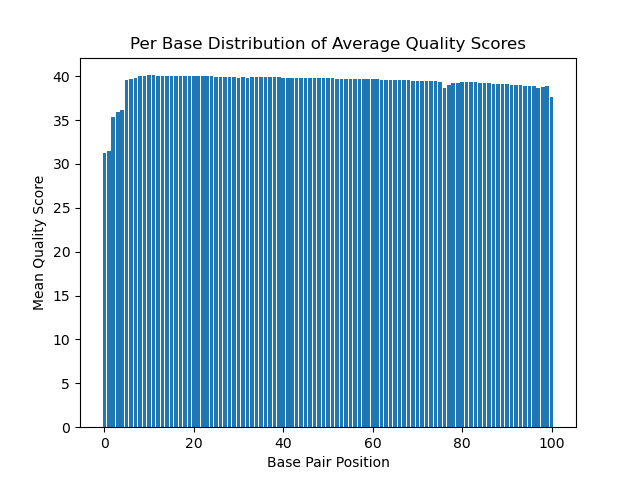

# Assignment the First

## Part 1
1. Be sure to upload your Python script. Provide a link to it here: [/part1.py](part1/part1.py)

| File name | label | Read length | Phred encoding |
|---|---|---|---|
| 1294_S1_L008_R1_001.fastq.gz | read 1 | 101 | +33 |
| 1294_S1_L008_R2_001.fastq.gz | index 1 | 8 | +33 |
| 1294_S1_L008_R3_001.fastq.gz | index 2 | 8 | +33 |
| 1294_S1_L008_R4_001.fastq.gz | read 2 | 101 | +33 |

2. Per-base NT distribution
    1. Use markdown to insert your 4 histograms here.
    
        Read 1 (Biological Read 1) Distribution:
            
    
        Read 2 (Index 1) Distribution:
            
    
        Read 3 (Index 2) Distribution:
            
        
        Read 4 (Biological Read 2) Distribution: 
            


What is a good quality score cutoff for index reads and biological read pairs to utilize for sample identification and downstream analysis, respectively? Justify your answer.

A good quality score cutoff for biological read pairs is 30. At Q30, there is a 1 in 1000 chance that a base call is incorrect, meaning it has a 99.9% accuracy rate. At this point, there should be very, very few or even zero errors in the sequence. This means that data with this high of a quality score would probably not lead to inaccurate conclusions when doing analyses. While you could set your cutoff to 40 to ensure even higher accuracy, it is likely this would very severely limit the breadth of your data to analyze. 

How many indexes have undetermined (N) base calls? (Utilize your command line tool knowledge. Submit the command(s) you used. CHALLENGE: use a one-line command)

Bash commands: 
    
Index 1 file: 
    
    ```
    $ zcat /projects/bgmp/shared/2017_sequencing/1294_S1_L008_R2_001.fastq.gz | sed -n                 '2~4p' | grep "N" | wc -l 
    ```
Output: 
    3976613
    
Index 2 file: 
```
    $ zcat /projects/bgmp/shared/2017_sequencing/1294_S1_L008_R3_001.fastq.gz | sed -n '2~4p' |        grep "N" | wc -l 

```
Output: 
    3328051

3976613 + 3328051 = 7304664 

7304664 indexes have undetermined based calls. 


    
## Part 2
1. Define the problem
2. Describe output
3. Upload your [4 input FASTQ files](../TEST-input_FASTQ) and your [>=6 expected output FASTQ files](../TEST-output_FASTQ).
4. Pseudocode
5. High level functions. For each function, be sure to include:
    1. Description/doc string
    2. Function headers (name and parameters)
    3. Test examples for individual functions
    4. Return statement
